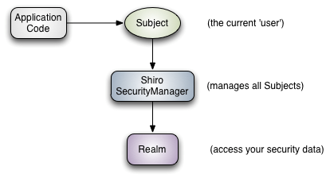
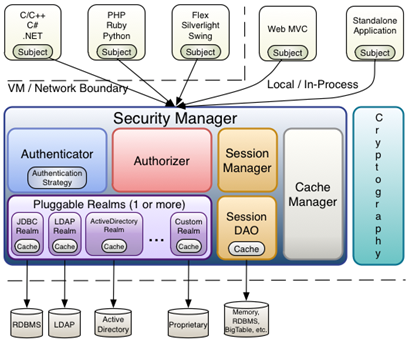

## Shiro简介
Apache Shiro是一个强大且可扩展的安全框架。Shiro可以帮助我们在J2SE和J2EE环境中完成：认证、授权、加密、会话管理、与Web集成、缓存等功能。

Shiro的主要功能点如下图：

- Authentication : 身份认证，验证用户是否拥有相应的身份
- Authorization : 权限验证，判定用户是否拥有某个权限
- Session Manager: 会话管理，在非Web及EJB环境中同样适用
- Cryptography: 加解密功能，例如对密码进行加密后存入数据库

其他组件可在特定环境下选择使用
- Web support : 集成到Web环境
- Caching: 缓存可提供性能
- Concurrency: 多线程环境中,可在线程间传递权限信息
- Testing: 可集成到单元/集成 测试中
- Run As: 在被允许情况下，可以假定为另一个用户进行操作
- Remember Me: 记住功能

!> Shiro不会维护用户、权限信息。需要开发者自己实现，并Realm注入提供给Shiro

## Shiro架构
对于一个好的框架而言，外部架构应该表现为具有简单且明确的API；内部架构应该具备可扩展性（因为任何框架都不能满足所有场景）
### 外部架构
我们可以从外部架构看到应用程序如何集成Shiro:

可以看到应用程序直接交互的对象是Subject API。

- Subject: 主体，可与应用交互的“用户”。所有的Subject都绑定到SecurityManager，且通过SecurityManager执行相应的操作，相当于是一个门面设计模式。
- SecurityManager：安全管理器,所有与安全相关的操作都会与SecurityManager交互。管理所有的subject，且负责与其他组件的交互。类似SpringMvc的DispatcherServlet
- Realm: 域，SecurityManager从Realm获取安全数据（用户、角色、权限）从而确定用户身份和权限。类似DataSource（安全数据源）

### 内部架构
我们可以从内部架构看到Shiro的各个部件

- Subject: 主体，同外部架构中Subject
- SecurityManager: 安全管理器，同外部架构中SecurityManager
- Authenticator: 认证器，负责主体认证。这是一个扩展点，可自定义实现。需要认证策略（Authentication Strategy）的实现来确认是否认证通过
- Authrizer： 授权器，负责判定用户是否有权限进行相关的操作
- Realm：域，同外部架构中Realm
- SessionManager: Session管理器，可在web环境、J2SE环境或则EJB环境中使用
- SessionDAO：Session的保存方式，可以放到内存、数据库、或则redis中
- CacheManager：缓存控制器，可用于如用户、角色、权限等信息的缓存
- Cryptography: 密码模块，提供了常见的加解密方案实现

